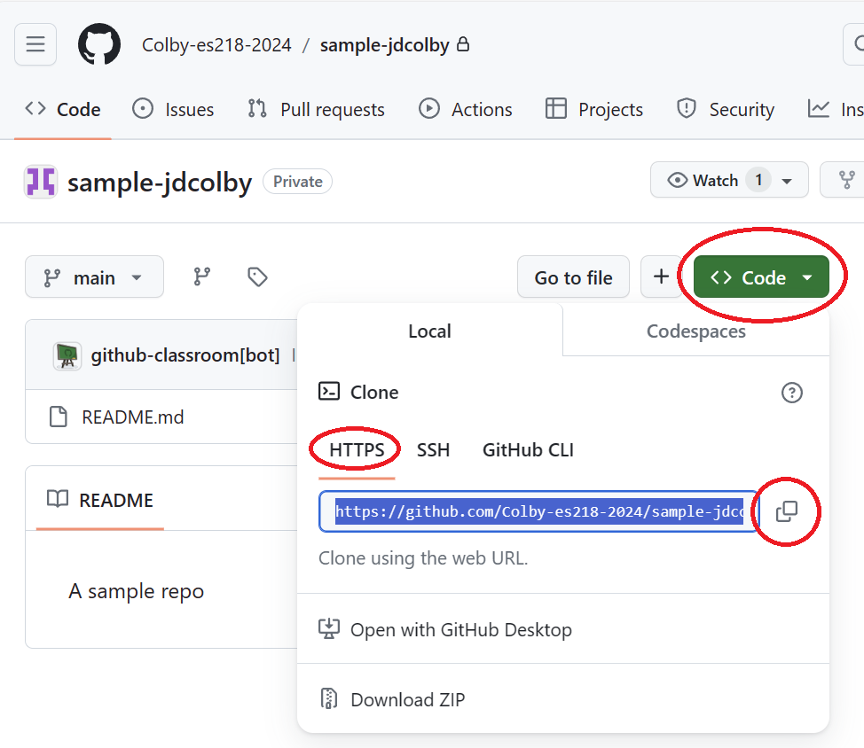

## Copying (cloning) a Github Repo locally to your computer

1. Bring up a git shell on your local computer (**Git Bash** on Windows; **Terminal** on Macs). You can also bring up the *Terminal* window in RStudio (lower left-hand pane).
2. Navigate to the folder where you will want to copy the new repo to. You can change directory using the `cd` command. For example, if you want to copy the repo to your `ES218` folder that resides under your home directory, type the following if you are working on a **Mac**:

   ```{r}
   cd ~/ES218
   ```

   If you are working on a **Windows** PC, type:
   
   ```{r}
   cd ~/Documents/ES218 
   ```    
   The tilde, `~`, is interpreted as you home directory. Alternatively, you could have typed the full directory path to your folder. For example, on a Windows machine, you could have typed:
   
   ```{r}
   cd /c/Users/jdcolby/ES218
   ```  

3. Navigate to the Github/repo page you want to clone.

4. Click on the *Code* button. This will reveal the full web path to your repo.

   

5. In your git shell, clone the repo by typing the link from the Github page. Make sure that the full link is copied (the last element of the link should end with `*.git`). For example, if the link is `https://github.com/jdcolby/repo1.git`, type: 

   ```{r}
   git clone https://github.com/jdcolby/repo1.git
   ```
    If you are prompted for a username and password, enter your Github credentials (and not your college credentials).   
    
   

  At this point, you have a clone (copy) of the repo content on your computer. You can now create/edit files in your project folder as needed. Be sure to save all project files in this folder.

   
