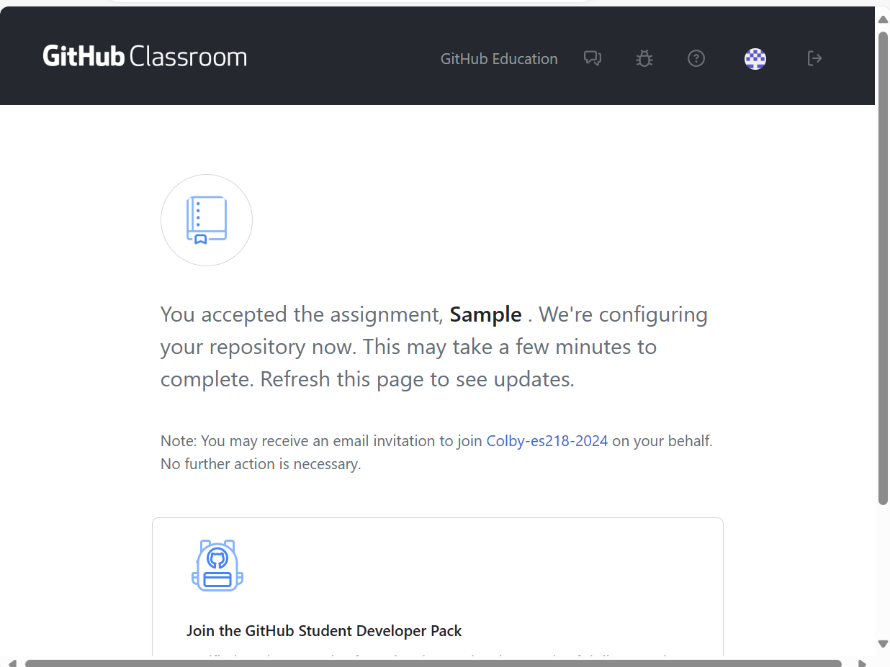
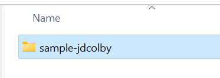

## Creating your GitHub repo from the course template

You will be provided with a link to create your GitHub repo for your assignment. Clicking on the link will bring up an "Accept the assignment" page (you might be asked to log in with your GitHub account).

 

 In this example, the assignmnent name is `Sample`. Each assignment will have a unique name.
 
 Click `Accept this assignment`. This will bring up the following page:

 

The page indicates that your assignment repository ("repo" for short) is being configured. You may need to **refresh** the page to see the link to your personal repo.


Clicking on the link in the blue box will bring you to your repo page.


The repo page will normally have a README file with instructions on how to tackle the assignment. But note that you will not create/modify the R scripts on GitHub. Instead, you will clone the repo onto your personal computer (in regular parlance, you will be creating an assignment folder on your PC from the GitHub repo). This is where your local installation of `git` comes into play.

## Copying (cloning) a Github Repo locally to your computer

1. Bring up a git shell on your local computer. On a **Mac**, you will open a **Terminal**.  On **Windows**, you will bring up a **Git shell**.

2. If your Git shell is in a folder other than where you plan to clone the project folder into, navigate to the folder where you will want to copy the new repo to. You can change directory using the `cd` command. For example, if you want to create the repo to your `ES218` folder that resides under your home directory, type the following if you are working on a **Mac**:

   ```{r}
   cd ~/ES218
   ```

   If you are working on a **Windows** PC, type:
   
   ```{r}
   cd ~/Documents/ES218 
   ```    
   The tilde, `~`, is interpreted as you home directory. Alternatively, you could have typed the full directory path to your folder. For example, on a Windows machine, you could have typed:
   
   ```{r}
   cd /c/Users/jdcolby/ES218
   ```  

3. In your web browser, navigate to the Github/repo page you want to clone. (Note that if you are given a link to a **GitHub Classroom** assignment, you will use that link instead and this as well as the next two steps).

4. Click on the *Code* button. This will reveal the full web path to your repo.

   

5. In your git shell, clone the repo by typing the link from the Github page. Make sure that the full link is copied (the last element of the link should end with `*.git`). For example, if the link is `https://github.com/jdcolby/repo1.git`, type: 

   ```{r}
   git clone https://github.com/jdcolby/repo1.git
   ```

6. If this is the first time you download a repo from GitHub on the computer you are working on, you may be presented with a **GitHub Sign in** window. If so, select the **Token** option.

   

In the Token field, paste the PAT token you created for the machine you are working on (following steps outlined in a [separate tutorial](https://mgimond.github.io/intro_to_git/authenticating_with_github.html)).

  At this point, you have a clone (copy) of the repo content on your computer. 

   
   
   To see the contents of the `repo1/` folder from the terminal, `cd` into that folder as follows:
   
   ```
   cd repo1
   ```
   
   then list the folder's contents:
   
   ```
   ls
   ```
   
   You should see the README.md file created up on GitHub in that folder.
   
   Note that the `repo1` folder also contains a hidden folder called `.git`. To see it, add the `-a` option as follows:
   
   ```
   ls -a
   ```
   
   Your terminal window should now display:
   
   ```
   .  ..  .git  README.md
   ```
   
   It's important that you do not delete the `.git` folder.
      
   You can now create/edit files in your project folder as needed. Be sure to save all project files in the cloned repo folder. 
   
   -----

[Back to the home page](index.html)

<div class="footer">
<hr/>
<a rel="license" href="https://creativecommons.org/licenses/by-nc/4.0/"></a>  Manny Gimond (2022)
</br>

