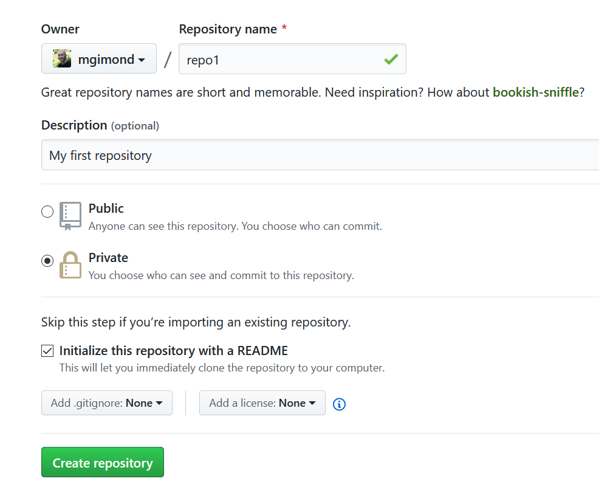

## Creating a new Github repository (aka repo)

In this example, you will create a new repo called `repo1`. 

1. Navigate to https://github.com and log in as yourself.
2. Click on the **Repositories** tab.
3. Click on the green **New** button.
4. Name the new repo `repo1`.
5. Provide a brief description (e.g. `"My first repo"`).
6. If you want to share the repo with the world, set it to public. If you want to keep it private, select private. In this example, we'll assume that you want to keep it **private**.
7. **Check the box** next to *Initialize this repository with a README*. 
8. Click on **Create repository**.

    

-----

[Back to the home page](index.html)

  Manny Gimond (2022)
 
