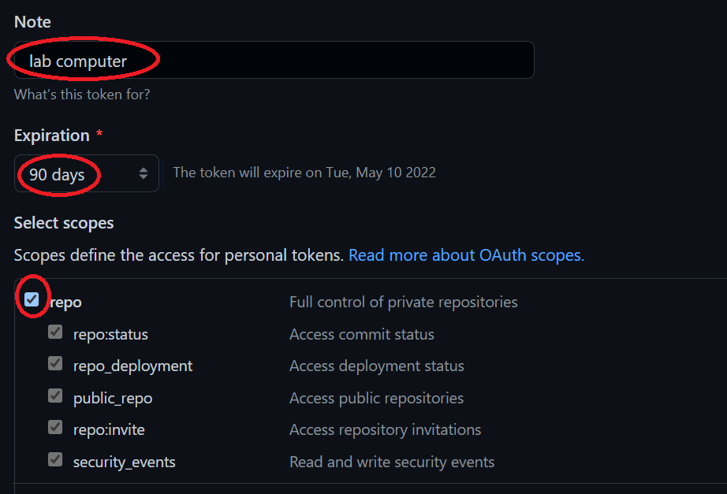
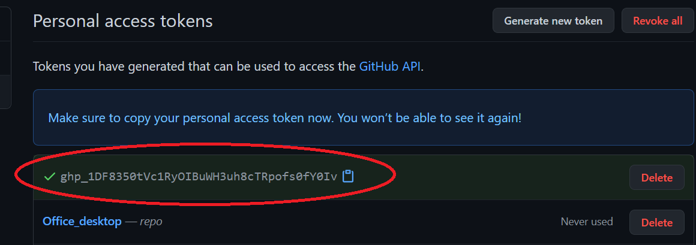
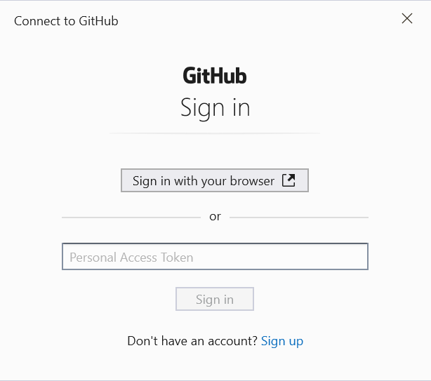
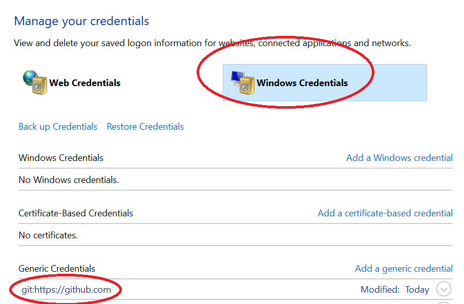

## Authenticating with GitHub

------

Prior to August 13, 2021, you were allowed to authenticate by typing a username and password every time you *pushed* or *pulled* from GitHub. For example, when pushing changes made in a local repo to GitHub, the session would look something like this:

```shell
$ git push
> Username for 'https://github.com': jdcolby
> Password for 'https://jdcolby@github.com': ******
```

When pushing and pulling repositories from GitHub, you might be prompted for your GitHub username and password. However, you cannot use the password used to access your GitHub web pages. Instead, you need to adopt one of several authentication options. The simplest (and the one used in this course) is the  **Personal Access Token** (**PAT**).  Another option not covered here but one that may be more robust in a professional setting is **SSH-based** authentication. If you want to learn more about SSH authentication, see [here](https://mgimond.github.io/Colby-summer-git-workshop-2021/authenticating-with-github.html). Note that if you are using a Linux OS, the SSH based authentication is a better solution.


A *Personal Access Token* (**PAT**) is unique to each computer you work off of. You would therefore need to repeat the following steps for each computer you are working off of.


First, you need to follow these steps on GitHub:

1. Click on your avatar (upper right-hand corner) and select **Settings**.

2. On the left sidebar, click on **Developer** **settings** (this should be near the bottom of the left sidebar).

3. In the left sidebar, click **Personal access tokens**.

4. Click **Generate new token** (button near the upper left-hand side).
   
5. In the *Note* field, assign a name to this token such as the local computer you are creating this token for.

6. In the next field, you can set an expiration date for this token, or make it permanent. In this example, we'll set it for 90 days.

7. From the **scopes** menu, select *repo*. This will allow you to read/write to your repo.




7. Click **Generate token** at the bottom of the page.

8. **Copy** and **temporarily save** the token before closing the window. 


   
When copying the token id, be careful not to add any empty spaces to the beginning or end of the token. It might be a good idea to temporarily paste the token into a plain text editor.

   > Note that you will not be able to access the token string once you exit the window! You might want to keep this window open until you've completed the steps outlined next.

Once you've created your token on GitHub, you simply substitute your GitHub password with your access token. For example, if you are cloning a private repo that your account has access to, you would enter the above token instead of your GitHub password.

```
$ git clone https://github.com/jdcolby/repo.git
Username: jdcolby
Password: <your token>
```

When you paste your token, you will not see it displayed on the command line. This might lead you to believe that it did not paste. Do not attempt a re-paste since this will only add the token to the end of the already pasted token.

Pasting your token each time you push or pull from your repo may prove cumbersome after a while. It might therefore be best to cache your token. This step is OS specific and is highlighted in the next subsections.

### Saving tokens in Windows

If you are using a Windows based Git application, you might see the following window pop-up when you are first asked to enter your token.



If so, you can paste the token into the *Personal Access Token* field.

Alternatively, you can add a git setting via the Windows Bash environment as follows:

```shell
git config --global credential.helper wincred
```

>  Note that this `config` option only works in the **Git for Windows Bash** shell.  This option will *not* work in a Windows WSL Ubuntu environment. If you are using WSL Ubuntu, you need to follow the Linux instructions listed below.

The credentials get stored in Windows' **Credential Manager**. You can delete this stored credential by accessing the Credential Manager via **Control Panel >> All Control Panel Items >> Credential Manager**  or by simply typing *Credential Manager* in the Windows' task bar.




### Saving tokens on a Mac

You'll need the **OSX keychain credential helper**.  If you installed Git using Homebrew or via the *Xcode* command line, then *osxkeychain* helper should be part of the installation.

You can check for its installation via the following command:

```shell
$ git credential-osxkeychain
```

To have Git store the token in *osxkeychain*, type:

```shell
$ git config --global credential.helper osxkeychain
```

The next time you are prompted for a user name and password, simply type your GitHub account name, then your personal access token. This will be a one time operation after which the token will be permanently stored. 

Click [here](https://docs.github.com/en/github/getting-started-with-github/getting-started-with-git/updating-credentials-from-the-macos-keychain) to for more information on using *Keychain* with Git.


-----

[Back to the home page](index.html)

<div class="footer">
<hr/>
<a rel="license" href="https://creativecommons.org/licenses/by-nc/4.0/"></a>  Manny Gimond (2022)
</br>


