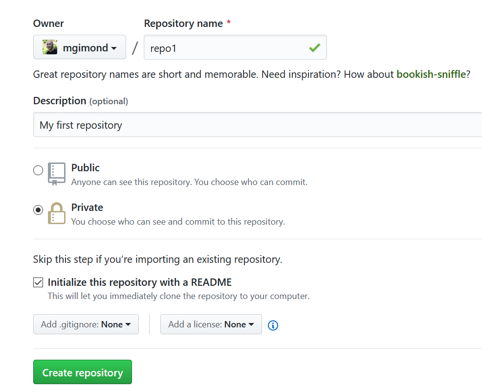
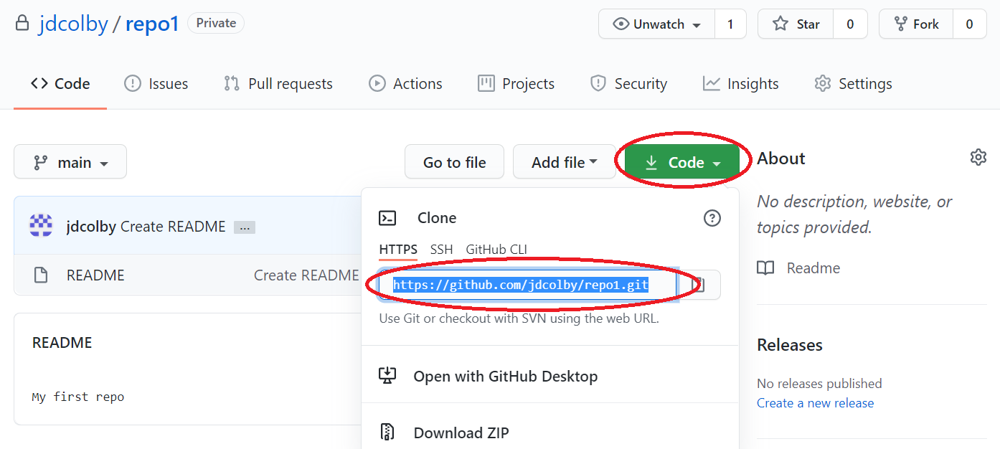
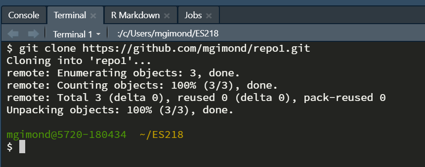
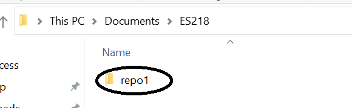

## Create a new Github repository (aka repo)

In the following steps, you will create a new repo called `repo1`. 

1. Navigate to https://github.com and make log in as yourself.
2. Click on the **Repositories** tab.
3. Click on the green **New** button.
4. Name the new repo `repo1`.
5. Provide a brief description (e.g. `"Testing a first repo"`).
6. If you want to share the repo with the word, set it to public. If you want to keep it private, select private. In this example, we'll assume that you want to keep it **private**.
7. **Check the box** next to *Initialize this repository with a README*. 
8. Click on **Create repository**.

    


## Copy (clone) the new Github Repo locally to your computer

1. Bring up a git shell on your local computer. You can also bring up the *Terminal* window in RStudio (lower left-hand pane).
2.  Navigate to the folder where you will want to copy the new repo to. You can change directory using the `cd` command. For example, if you want to copy the repo to your `ES218` folder that resides under your home directory, type the following if you are working on a **Mac**:

   ```{r}
   cd ~/ES218
   ```

   If you are working on a **Windows** PC, type

   ```{r}
   cd ~/Documents/ES218
   ```

     The tilde, `~`, is interpreted as you home directory. ALternatively, you could have typed the full directory path to your folder. For example, on a Windows machine, you could have typed:

    ```{r}
    /c/Users/mgimond/ES218
    ```

3. Navigate back to your repo page on the Github website.
4. Click on the *Clone or Download* button. This will reveal the full web path to your repo.

   

5. In your git shell, clone the repo by typing the link. For example, if the link is `https://github.com/mgimond/repo1.git`, type 

   ```{r}
   git clone https://github.com/mgimond/repo1.git
   ```
   

  At this point, you have a clone (copy) of the repo content on your computer. You can now create/edit files in your project folder as needed. Be sure to save all project files in this folder.

   
