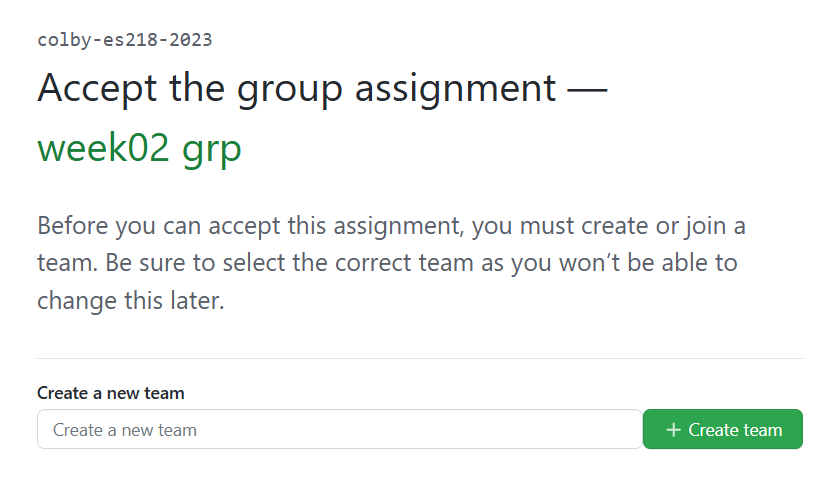
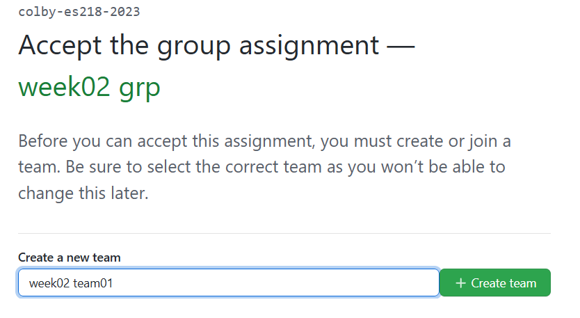
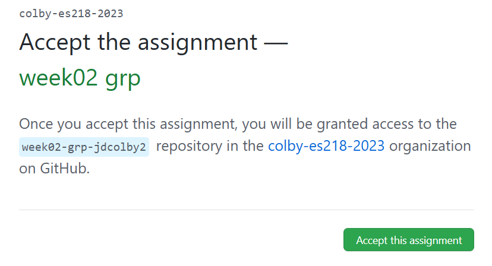
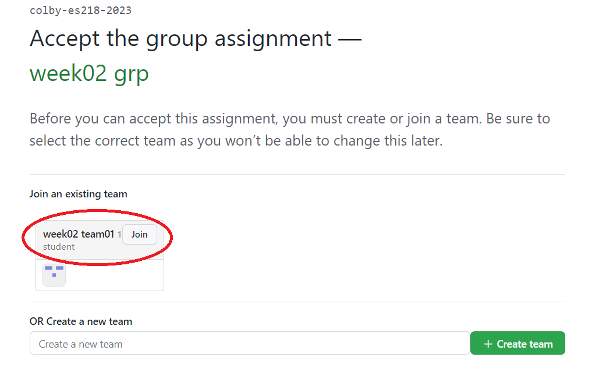

# Cloning a team repo for Friday's group sessions

## 1.   Group leader clones the repo first

The **group leader will be first to  connect to the repo template** since s/he will need to create the team id.

The instructor will provide you with the link to this week's group repository template via the Moodle website. Open the link in a web browser.

You will be asked to create a team name. 

{ width: 300px; }

If you are team `1` and it's `week 02`, you will type `week02 team01` in the empty field then click on `Create team`.
  
 
  
In the next window, click on `Accept this assignment`.

At this point, your copy of the repo template will be generated. You might need to refresh your browser to see the new repo link.  Clicking on that link will bring you to your copy of the repo.

##  2.   Team members clone repo next

Next, each team member will point to the same  repo.sitory template link provided on Moodle. The team member will select the group created by the team leader, `week02 team_01` in this working example. Click on the `Join` button next to the team name.

The next window should indicate that you are ready to got. You will be provided with the same group repo link as that of the team leader. At this point, the team members have access to whatever the team leader pushes to GitHub. Technically, this is a group repo where all members can contribute to its content. But to keep the process simple and avoid any confusion, you will let the team leader take the helm and provide support via the classroom monitor.
