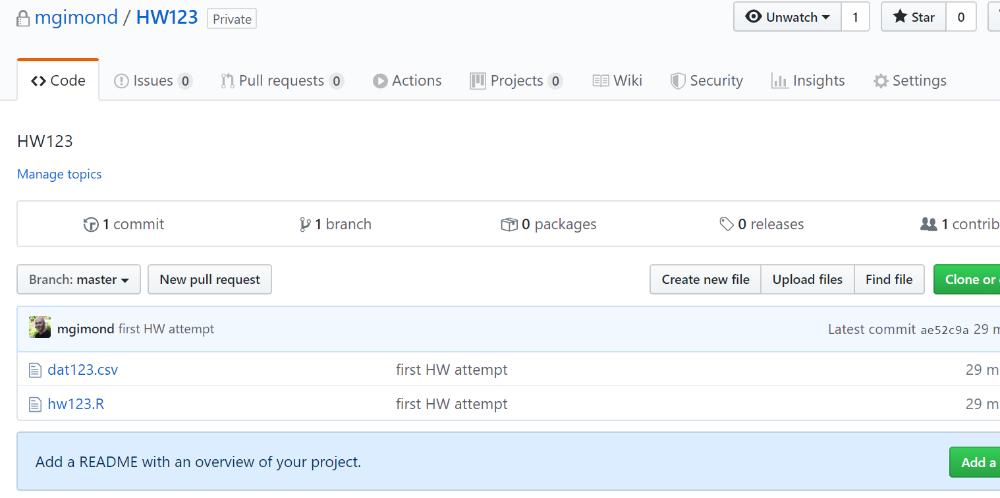

Proceed with the following steps when you are ready to push (upload) your local project folder back to your github account. Note that you do not need to wait until you feel as though you have a final version of your assignment or project before pushing it to your github account. You can push many different versions of you project folder as needed.

1. Make sure that you've saved any project R/Rmd script before pushing your project folder.  

2. The final step is to **push** your local commited files/folders to your Github repo as follows:  
     ```
     git push -u origin master
     ```
     If you are prompted for a username/password, this is refering to your Github account (and not your school account).  
     
        
     
3. Finally, check your Github repo for the updates. You should see the comment next to the updated or newly added files.  
  
        
  
