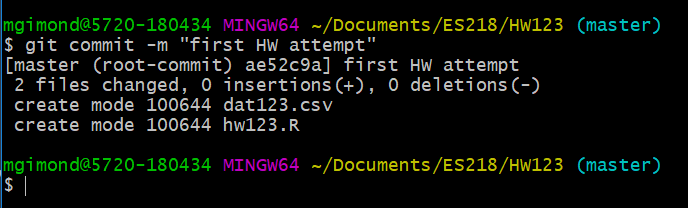
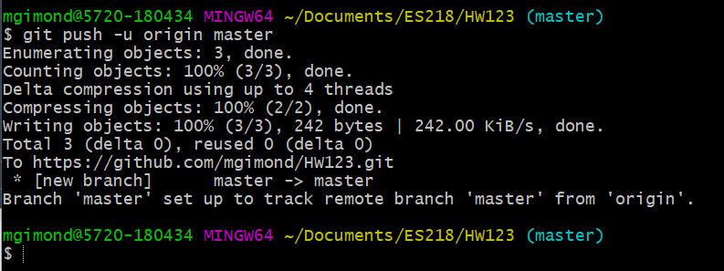

Proceed with the followinhg steps when you are ready to push (upload) your local project folder back to your github account. Note that you do not need to wait until you feel as though you have a final version of your assignment or project before pushing it to your github account. You can push many different versions of you project folder as needed.

## Quick instructions

If you don't need to review the step-by-step instructions, the basic steps follow. We'll assume that the repo is named `HW123` (this should be the same name as your local project folder). 

We will frequently make use of these commands:
```
git add --all
git commit -m "type your message here"
git push -u origin master
```

## Step-by-step instructions

1. Make sure that you've saved any project R/Rmd script before pushing your project folder.
2. Open a git bash shell. Alternatively, you can use the *Terminal* pane in RStudio.
3. **Navigate** to your project folder using the `cd` command. Remember that you can use the short cut `~` character to reference your home directory. In this example, we are assuming the tha project folder is named `HW123`.
     ```
     cd ~/Documents/ES218/HW123
     ```
      
     
   You can check the contents of the folder by typing `ls`. If you want to view hidden files, type `ls -a`. 
   
    
   
   You should see, at the very least, a `.git/` folder. If you do not, then you are not working off of a cloned repo or a git environment was not properly generated.
   
4. The next step involves **staging** your work. Basically, this step allows you to select the files and/or folders that you want to push to Github (but it does not push it just yet). 

   You can add files/folders individually (this option should be chosen if you have R/Rmd files that you do not wish to upload to github). For example, to *stage* the files `dat123.csv` and `hw123.R` type:
    ```
    git add dat123.csv hw123.R
    ```
    Alternatively, if you want all files and folders to be uploaded to your Github repo, type:
    ```
    git add --all
    ```
       
  5. **Check** that the files are properly staged by typing `git status`. Any files ready to be pushed to Github should be highligthed in green.
  
       
  
  
  6. The next step involves **commiting**. Here, you will simply add a *message* to your commit. While this may not be very useful for a homework assignment, it can be very useful in helping revert back to an earlier version of a project by using the comments as placeholders for various versions of project. In such a case, you usually want to use short but descriptive comments to help pinpoint key changes to a project file. For a homework assignment, this is less crictical, but for good practice, you are encouraged to make good use of this step. Here, we'll label this commit `first HW attempt` as follows:
      ```
      git commit -m "first HW attempt"
      ```
      
         
      
      
  7. The final step is to **push** your local commited files/folders to your Github repo as follows:
     ```
     git push -u origin master
     ```
     If you are prompted for a username/password, this is refering to your Github account (and not your school account).
     
          
     
  8. Finally, check your Github repo for the updates. You should see the comment next to the updated or newly added files.
  
       
  
