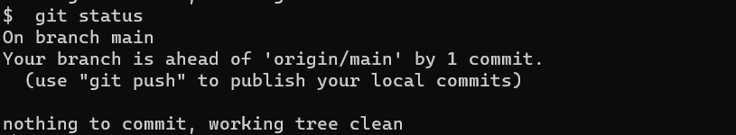
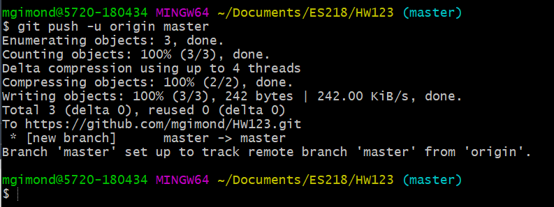
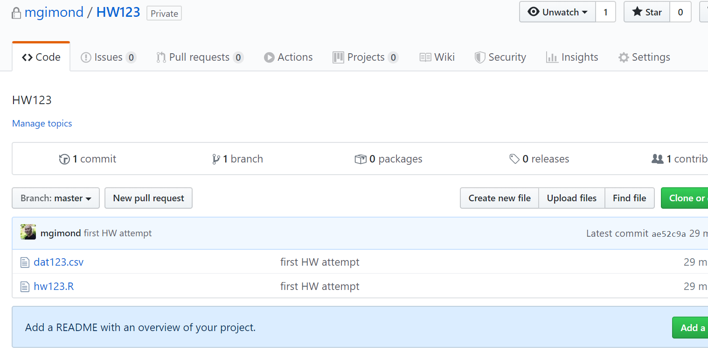

## Staging/committing and pushing to GitHub

Proceed with the following steps when you are ready to stage, commit, then push (upload) your local project folder back to your github account. Note that you do not need to wait until you feel as though you have a final version of your assignment or project before pushing it to your github account. You can push many different versions of you project folder as needed.

1. Make sure that you've saved all R/Rmd scripts before proceeding.  

2. In a terminal, place yourself in the project folder (aka repo folder) using the `cd` command (see [here](Cloning_a_Github_repo#copying-cloning-a-github-repo-locally-to-your-computer) for a refresher on navigating directories in a terminal using the `cd` command). To check that you are indeed in the project folder, type `pwd`.

3. Stage, then commit the changes made to your project folder. These **commits** act as "bookmarks"" in the evolution of your project folder.  Type the following:

```
git add --all
git commit -m "type your message here"
```

When committing changes, be sure to add a meaningful message in between the quotes. The message is what you use to track various versions of your commit. 

4. Check that your changes have been properly committed using the `git status` command. You should see a message along the lines of `"Your branch is ahead of 'origin/main' by X commits"`.

 


4. The final step is to **push** your local committed files/folders to your Github repo as follows:  

  `git push -u origin main`
  
  or simply:
  
   `git push`


On a Mac, you may be prompted for a password. 
     
 
     
3. Finally, check your Github repo for the updates. You should see the comment next to the updated or newly added files. The following snapshot assumes that the repo is named `HW123`. 
  
 
  
-----

[Back to the home page](index.html)

<div class="footer">
<hr/>
<a rel="license" href="https://creativecommons.org/licenses/by-nc/4.0/"></a>  Manny Gimond (2022)
</br>
