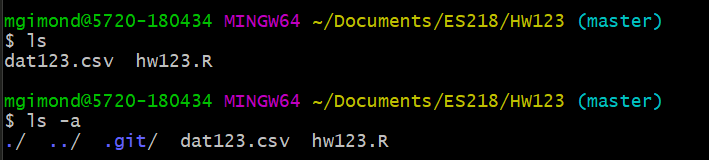
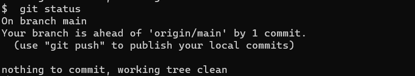

Proceed with the following steps when you are ready to commit changes made in your local repo folder such as modifying R scripts or adding/removing files. These **commits** act as "bookmarks"" in the evolution of your project folder. Changes made to your project folder can be undone by referencing these bookmarks.

## Quick instructions

If you don't need to review the step-by-step instructions, the basic steps follow. We'll assume that the repo is named `HW123` (this should be the same name as your local project folder). 

```
git add --all
git commit -m "type your message here"
```

## Step-by-step instructions

1. Make sure that you've saved any R/Rmd scripts before committing .
2. Open a git bash shell. Alternatively, you can use the *Terminal* pane in RStudio.
3. **Navigate** to your project folder using the `cd` command. Remember that you can use the short cut `~` character to reference your home directory. In this example, we are assuming the that project folder is named `HW123`, which is a repository created and cloned to the folder `ES218`.
     ```
     cd ~/Documents/ES218/HW123
     ```
      
     
   You can check the contents of the folder by typing `ls`. If you want to view hidden files, including the `.git` folder, type `ls -a`. 
   
    
   
   You should see, at the very least, a `.git/` folder. If you do not, then you are not working off of a cloned repo or a git environment was not properly generated.
   
4. The next step involves **staging** your work. Basically, this step allows you to select the files and/or folders that you want to commit. 

   You can add files/folders individually (this option should be chosen if you have R/Rmd files that you do not yet want to commit). For example, to *stage* the files `dat123.csv` and `hw123.R` type:
    ```
    git add dat123.csv hw123.R
    ```
    Alternatively, if you want all files and folders to be uploaded to your Github repo, type:
    ```
    git add --all
    ```
       
  5. **Check** that the files are properly staged by typing `git status`. Any files ready to be pushed to Github should be highlighted in green.
  
       
  
  
  6. The next step involves **committing**. Here, you will simply add a *message* to your commit. This step can be very useful in helping revert back to an earlier version of a project by using the comments as placeholders for various versions of project. In such a case, you usually want to use short but descriptive comments to help pinpoint key changes to a project file. For a homework assignment, this is less critical, but for good practice, you are encouraged to make good use of this step. Here, we'll label this commit `first HW attempt` as follows:
      ```
      git commit -m "first HW attempt"
      ```
      
         
        
  6. You can once again run the `git status` command to check that any change in your local repo was properly staged and commited.

       
